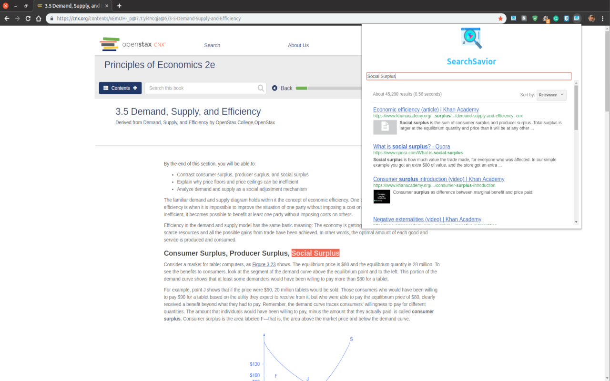

# SearchSavior
A Seamlessly Integrated Browser Extension For Conducting Better Academic Searches

* Copyright 2019, Akshay R. Kapadia
* License: GPL-3.0
* Version: 2.1.0
* Status: Development

---

---

SearchSavior is a fast and convenient way for users to quickly search for academic concepts within the same tab. The extension allows users to specifically search websites like Youtube, Khan Academy, Wikipedia, Yahoo Answers, Quora, Stack Overflow, Stack Exchange.

Tip: select a word or phrase then open the SearchSavior extension to automatically search.

Future features: definitions, add/remove custom sources, and search history tab.

---
Logo made by Freepik from www.flaticon.com and is licensed by the Creative Commons BY 3.0 License.
